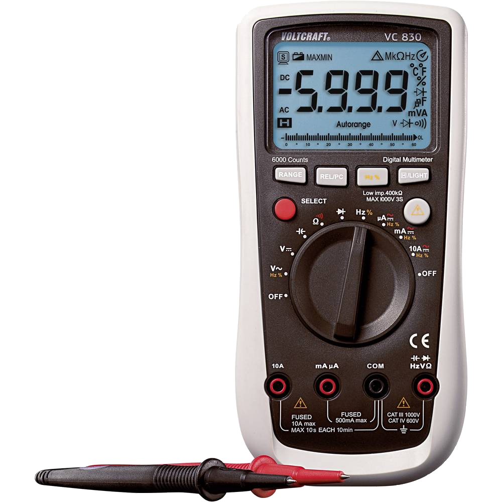
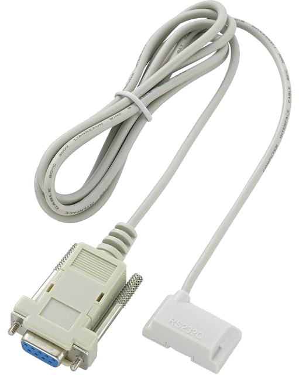

# Voltcraft-VC830

vc840 is a little C program which reads serial data from a voltcraft VC830 digital multimeter and transform it to different output signals.

The VC830 is based on the FS9922-DMM4 IC from Fortune Semiconductor Corporation, see the [FS9922-DMM4-DS-15_EN.pdf](http://www.ic-fortune.com/upload/Download/FS9922-DMM4-DS-13_EN.pdf) manual.

### Motivation

After different tests with [sigrok](https://sigrok.org) I didn't find a working solution with this framework and its vc830 driver. Additionaly, having some RS232 adapter problems (the adapter uses an optical IR recveiver and needs power from RTS/DTR lines) I decided to "understand" the whole situation. And what's better suited than solving the problem by myself for doing that? 🤔

Here we are...

### Compiling

The program has no dependencies to external libraries and you can simple compile the single file with gcc or use the given Makefile:

```bash
$ make
gcc -O3 -Wall -o vc830.armv7l vc830.c
```
Because I worked with multiple environments, a architecture extension is added to the compiled program (.armv7l in this case).

### Program Parameter

The program supports the following parameters:

```
Usage: vc830 [-f output-format] [-t time-format] [-c count] <tty device>.
              -f   output-format  keyvalue, json, human, si.           Default = human
              -t   time-format    iso, local, epochsecms, human, none  Default = none
              -c   count          number of samples                    Default = endless
```

### Running


You need to start the data transmission on the VC830 by pressing the REL/PC key for about 2 seconds.

If you have a connected VC830 (as device <code>/dev/ttyUSB0</code> in my case) you can use the following command:

```bash
$ ./vc830.armv7l /dev/ttyUSB0
-8.26 V		DC	AUTO
-8.26 V		DC	AUTO
-8.26 V		DC	AUTO
...
```

This will produce around 2 samples per second.

You can also test the program with the test data set. If you don't want the default output format, use the option <code>-f keyvalue/json/human/si</code> with one of the format specifier.

```
$ ./vc830.armv7l -c 1 -f json test.dat
```
#### Output formats:
##### JSON output:
```json
{
  "receivedAt": "2021-04-17T23:45:51.173158+0200",
  "sign": "-",
  "mode": "DC",
  "unit": "V",
  "prefix": "",
  "fullUnit": "V",
  "info": "AUTO",
  "barGraph": 8,
  "barGraphIsShown": true,
  "batteryWarning": false,
  "autoRangeActive": true,
  "holdActive": false,
  "deltaActive": false,
  "overflow": false,
  "rawRisplay": "08.26",
  "formatedValue": "-8.26 V",
  "formatedSiValue": "-8.26 V"
}
```
##### KEY/VALUE output:
```
receivedAt=2021-04-18T00:59:12.597168+0200
sign=-
mode=DC
unit=V
prefix=
fullUnit=V
info=AUTO
barGraph=8
barGraphIsShown=true
batteryWarning=false
autoRangeActive=true
holdActive=false
deltaActive=false
overflow=false
rawRisplay=08.26
formatedValue=-8.26 V
formatedSiValue=-8.26 V

```

##### "Human" output:
```
-8.26 V		DC	AUTO
```

##### SI output:
Same as "Human", but the value is normalized to SI base units. E.g. if the VC830 with autorange enabled (default) has "50 mV", then the output shows:

```
0.050 V		DC	AUTO
```

#### Time formats:
You can prefix the "Human" and SI outputs with different time formatings. In the JSON and Key/Value output you will find the chosen time format in the <code>receivedAtFormated</code> field. The <code>receivedAt</code> field always contains the [ISO 8601](https://en.wikipedia.org/wiki/ISO_8601) format.

Use the <code>-t iso/local/epochsecms/human</code> to select one.

### Additional files

- `watch_and_compile.sh`<br>
Background compile script. Calls the makefile every time the source is changed. Ideal for fast developments with different operating systems. This script needs the fswatch package (install with "apt install fswatch" on debian or "brew install fswatch" on macOS)
- `capture_data.sh`<br>
Dumps from raw data from serial device to file ***test.dat***. This file can be used as a input file to test the program. _You should start the vc830 once before to setup the serial parameter (2400 baud)!_.
- `test.dat`<br>
Pre-Captured data with different measurements.

### Tested

-  macOS
-  Debian on Rasberry Pi


I used a [RS232 adapter](https://www.conrad.de/de/p/voltcraft-rs-232-rs-232-rs-232-schnittstellenadapter-fuer-voltcraft-multimeter-1-st-125640.html) and a [7404 chip](https://upload.wikimedia.org/wikipedia/commons/thumb/f/f4/7404_Hex_Inverters.PNG/533px-7404_Hex_Inverters.PNG?uselang=de) to invert the signal level, because I had no "real" RS232 interface available.

### Formatter
The C source is formated with:

```
{ BasedOnStyle: Google, IndentWidth: 4, ColumnLimit: 0, AlignConsecutiveAssignments: true, AlignConsecutiveMacros: true, AlignConsecutiveDeclarations: true, AlignOperands: true, AllowShortBlocksOnASingleLine: true, AllowShortIfStatementsOnASingleLine: true, AllowShortLoopsOnASingleLine: true, KeepEmptyLinesAtTheStartOfBlocks: true, BreakBeforeBraces: Linux }
```

### Maybe ToDos

- Describe adapter circuit 
- Add CSV output option
- Add symlinks for device files
- Loop until device file appears (waiting until USB adapter is plugged in)
- Suppress multible same outputs (stable measurement)
- ...

Have fun,<br>
&nbsp;&nbsp;Thomas Welsch. ttww@gmx.de, 2021
  

 


